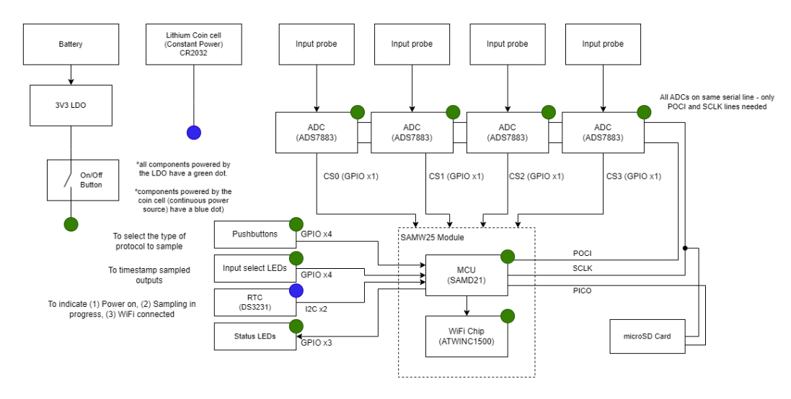
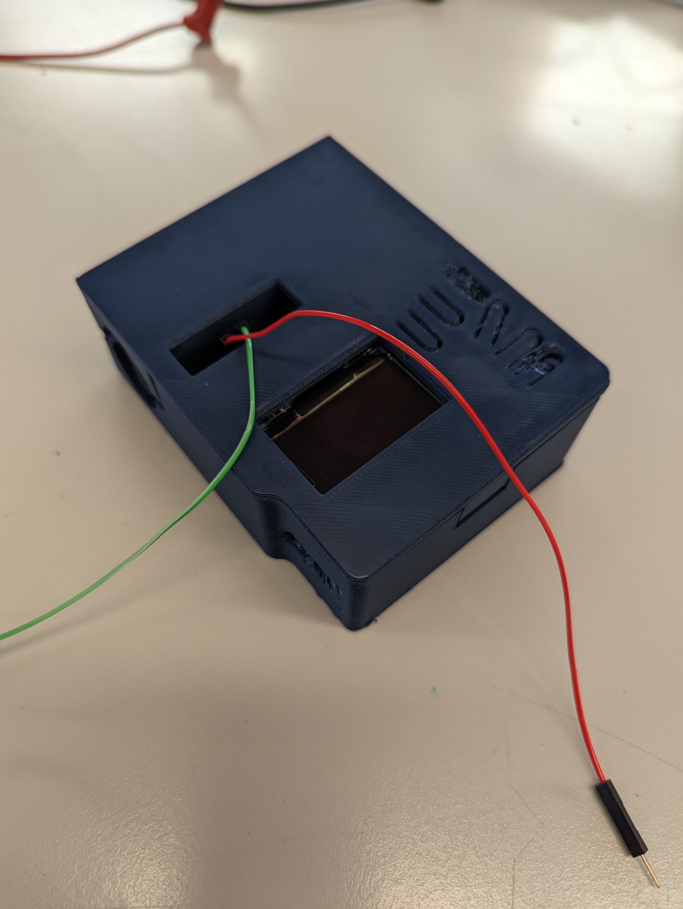
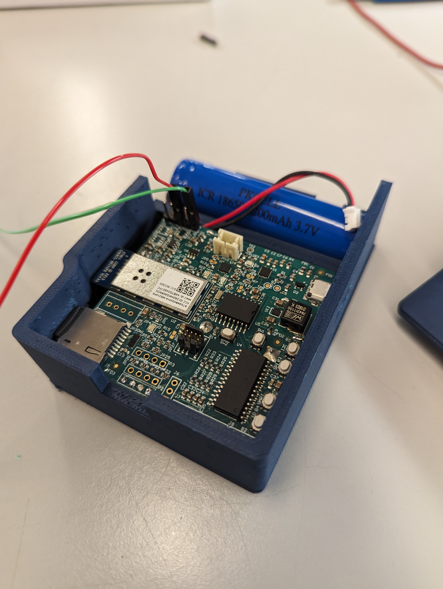
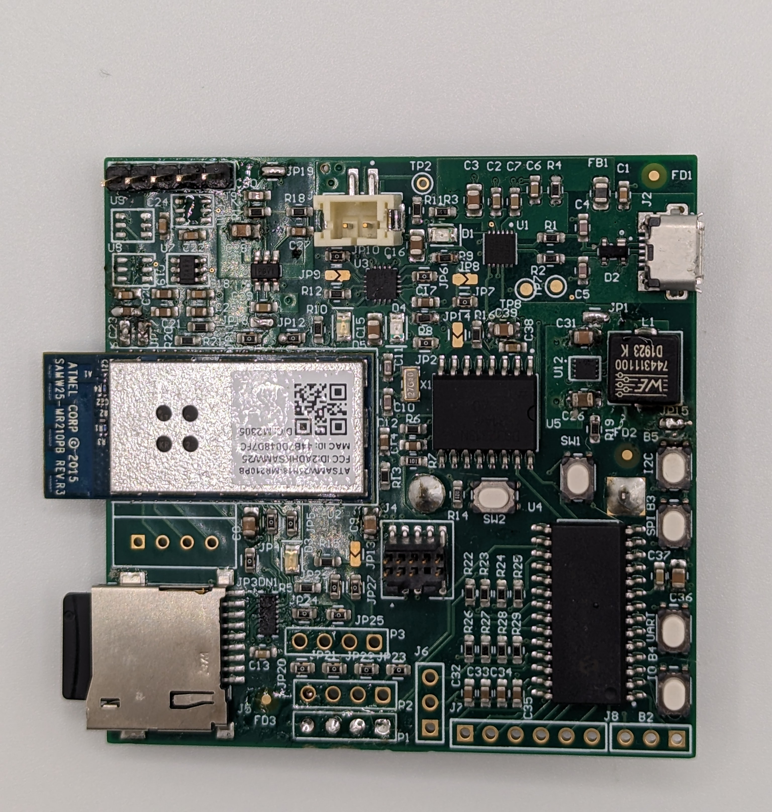
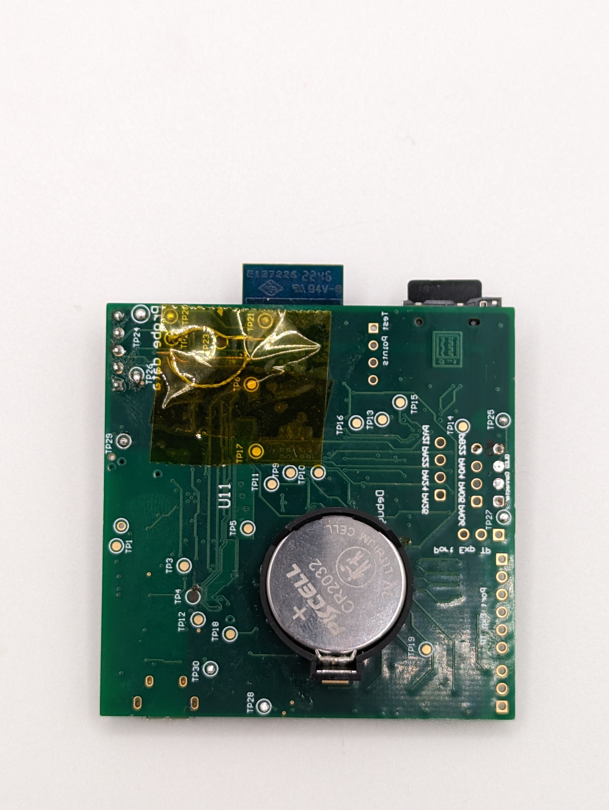
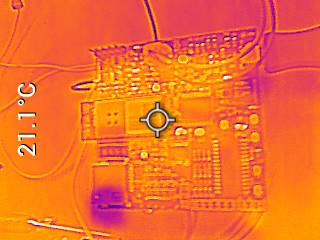
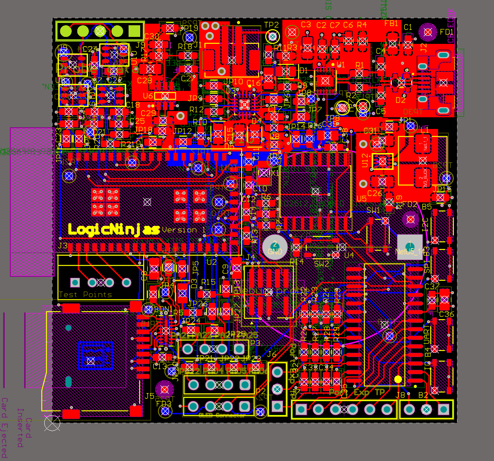
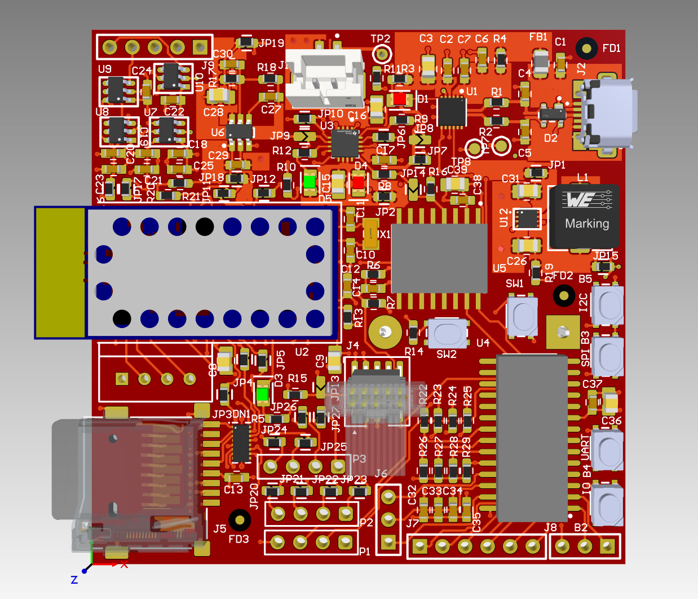
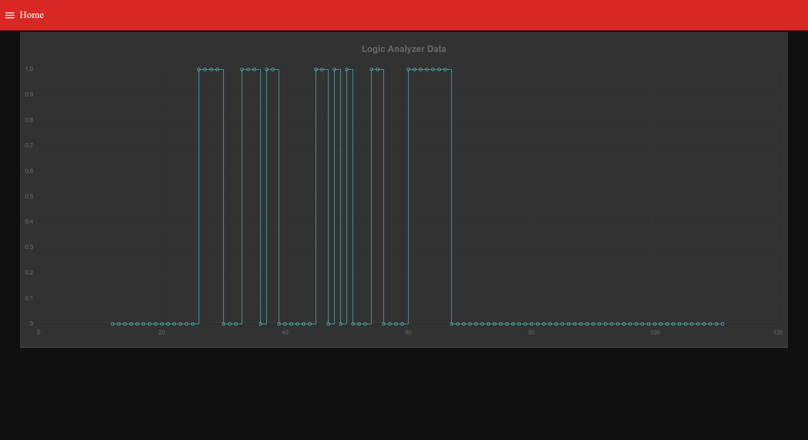
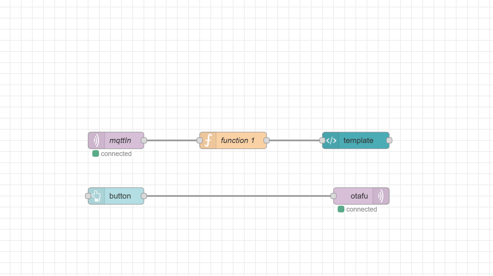

# a14g-final-submission

    * Team Number: 6
    * Team Name: Logic Ninjas
    * Team Members: Vishnu Venkatesh and Yadnik Bendale
    * Github Repository URL: [https://github.com/ese5160/ec01g-mcad-model-t06-logic-ninjas/tree/main](https://github.com/ese5160/a14g-final-submission-t06-logic-ninjas)
    * Description of test hardware: PCBA, SAMW25

## 1. Video Presentation

Link to video presentation of video: 
[Video Demonstration](https://youtu.be/Bzsq5E1G8jM)

Video Credits: Maryam Ali

## 2. Project Summary

### Device Description
- **Problem Solved**: 
  Our logic analyzer is a compact and user-friendly tool designed specifically for system developers working in dynamic environments, such as mobile robotics. The device supports essential protocols including SPI, UART, I2C, and GPIO, enabling it to monitor, sample, and decode data traffic effectively. It features an integrated real-time clock that timestamps transactions precisely, aiding in accurate diagnostics and analysis. The data captured is wirelessly transmitted to a web server, allowing users to access and interpret the decoded signals through a web-based dashboard. This functionality is crucial for streamlining the debugging process and enhancing the efficiency of system development tasks.

- **Internet Usage**: 
  The device utilizes Internet connectivity to enable remote data monitoring and analysis. By sending captured data to a cloud-based server, it allows users to access and interpret data from anywhere via the web-based dashboard. This connectivity not only facilitates immediate data access but also supports real-time alerts and updates, enhancing the user's ability to make informed decisions quickly.

### Inspiration
- **Motivation**: 
  The idea for this device was inspired by the challenges faced by professionals in various fields who require robust and mobile diagnostic tool without needed an external device like a loptop to display the probed data, some potential target domains are:
  
  - **Embedded Systems Engineers**: Enables on-site debugging without dismantling equipment.
  - **Robotics Developers**: Facilitates real-time monitoring and troubleshooting of robotic systems in motion.
  - **DIY Electronics Hobbyists**: Ideal for experimentation with electronics projects in any setting.
  - **Quality Assurance Professionals**: Streamlines electronic device testing in manufacturing environments.
  - **Industrial Automation Technicians**: Key for diagnosing communication issues in automated machinery without halting production.
  - **IoT Developers**: Critical for remote diagnostics of IoT devices in smart environments.
  - **Automotive Electronics Engineers**: Useful for wireless diagnostics and performance checks in vehicular systems.
  - **Windmill Maintenance Technicians**: Enables monitoring and fault finding in wind turbines without physical disassembly.

### Device Functionality
- **Design Overview**: 
  The device is equipped with four ADCs, each dedicated to monitoring a specific communication protocol, enhancing the precision of data capture. An RTC is integrated for timestamping data, which is stored on an SD card with timestamps used as file names. A port expander is utilized to increase the number of I/O ports on the board, accommodating additional functionalities. The primary actuator is the display, which notifies the user when data is being probed.

- **Block Diagram**: 

### Challenges
- **Difficulties Encountered**: 
  The development faced several challenges:
  - Incorrect swapping of CS and SCLK lines on the PCB.
  - Managing task prioritization and monitoring for three I2C devices sharing the same bus.
  
- **Solutions**: 
  - We resolved the PCB wiring issues by cutting the incorrect traces and manually rewiring them.
  - Extensive manual testing and real-time monitoring through Percipio helped us refine task management and bus allocation.

### Prototype Learnings
- **Lessons Learned**: 
  The development process highlighted the importance of rigorous pre-production testing and the need for detailed schematic reviews to prevent layout errors. Additionally, real-time task monitoring proved invaluable in optimizing system performance and stability.

- **Improvements**: 
  Future iterations will correct the PCB design issues related to CS and SCLK line placements and consider using ADCs with higher resolution and faster sampling rates to enhance data accuracy.

### Next Steps
- **Future Improvements**: 
To advance the project, we plan to upgrade the ADCs to models with superior resolution and sampling rates. This improvement will significantly enhance the device's capability to handle more complex and faster signal analyses, meeting the growing demands of advanced applications.

### Project Links
- **Node-RED URL**: [Node-RED URL](http://13.90.136.162:1880/)
- **A12G Repository Link**: [Repository](https://github.com/ese5160/a12g-firmware-drivers-t06-logic-ninjas)
- **Altium 365 PCBA Link**: [Altium Web Link](https://upenn-eselabs.365.altium.com/designs/2FE26589-F062-4F1A-9B85-5B038DE51B92)
- Website Link: [Github Pages](https://ese5160.github.io/a14g-final-submission-t06-logic-ninjas/)

### Open Source and Acknowledgements
- **Open Source Use**: 
  Our project integrates several open-source components, ensuring adherence to their respective licenses, we took references from the following sources:
  - **DS3231-RTC Library**: This library is used as a reference for writing the drivers for interfacing with the DS3231 real-time clock module over SAMW25. It is sourced from [hasenradball's DS3231-RTC repository on GitHub](https://github.com/hasenradball/DS3231-RTC).
  - **ESP32 I2C LCD1602 Example**: We utilized this example code as a reference to manage the LCD display via the I2C protocol, over SAMW25. The source code is available at [DavidAntliff's GitHub repository](https://github.com/DavidAntliff/esp32-i2c-lcd1602-example/tree/master).

- **Acknowledgements**: 
  The development of our project was supported by various tools and platforms that significantly enhanced our productivity and debugging capabilities:
  - **Percepio**: This software was instrumental in monitoring and visualizing runtime operations, greatly aiding in the debugging and optimization of our firmware.
  - **Microchip Studio**: We used Microchip Studio for development, which provided a robust environment for coding, compiling, and testing our embedded software.
  - **Node-RED**: Employed for creating and managing flow-based programming setups, Node-RED facilitated the integration and testing of network communications within our device.
  
  We extend our gratitude to all the developers and communities behind these resources. Their tools and code were invaluable in bringing our project to fruition.

## 3. Hardware & Software Requirements

### Hardware Requirements

- **HRS 01**: Incorporate an external ADC with a sampling frequency exceeding 800kHz for precise, high-resolution data capture.
  - Status: Achieved and verified with an oscilloscope.

- **HRS 02**: Ensure at least a single sample per bit for each protocol, with enhanced sampling capabilities for faster protocols to accommodate various speeds and baud rates.
  - Status: Partially met; limited to one constant bit rate due to ADC hardware constraints.

- **HRS 03**: Design the device to process captured signals and wirelessly transmit this data to a web server, facilitating remote data analysis.
  - Status: Successfully implemented, with data visualized in real-time on a Node-RED dashboard.

- **HRS 04**: Include a user-friendly push button interface for protocol selection, with each button activating sampling and indicating the active protocol via its corresponding LED.
  - Status: Achieved using a port expander over the I2C protocol.

- **HRS 05**: Integrate a microSD card slot for comprehensive data logging of each sampling session, ensuring robust data retention.
  - Status: Implemented; data is saved to the SD card in real-time upon button press.

- **HRS 07**: Equip the device with a manual power supply switch, giving users direct control over its power state and enhancing energy efficiency.
  - Status: Not implemented due to predefined power circuitry constraints.

- **HRS 08**: Utilize LED indicators to visually signal various device statuses, including power, sampling activity, and Wi-Fi connectivity.
  - Status: Replaced LEDs with a screen, effectively indicating data sampling status.

- **HRS 09**: Power the device with batteries, incorporating an LDO to ensure stable operation and extend battery life, enhancing portability.
  - Status: Successfully implemented; device operated correctly with an external battery.

- **HRS 10**: Utilize the SAMD21 microcontroller as the processing core, managing core tasks and wireless communication for reliable performance.
  - Status: Successfully demonstrated on demo day.

- **HRS 11**: Integrate a real-time clock for precise timestamping of data samples and transactions, crucial for accurate diagnostics.
  - Status: Successfully implemented.

- **HRS 12**: Minimize processing and communication delays, aiming for data display on the user interface within 2 seconds of sampling.
  - Status: Achieved with effective wireless transmission rates.

### Software Requirements

- **SRS 01**: Develop firmware in bare-metal C to optimize performance and precision in signal processing.
  - Status: Not implemented; firmware developed using FreeRTOS, meeting design needs.

- **SRS 02**: Implement an RTOS to efficiently manage multiple concurrent tasks, including data sampling, processing, and communication.
  - Status: Achieved; however, experienced challenges with multiple I2C devices and memory management.

- **SRS 03**: Include algorithms to decode signals from protocols such as I2C, SPI, UART, and GPIO, ensuring broad communication compatibility.
  - Status: Successfully implemented using queues.

- **SRS 04**: Provide a web-based user interface that displays data clearly and intuitively, enabling effective signal analysis.
  - Status: Implemented using Node-RED.

- **SRS 05**: Offer configurable settings for Wi-Fi credentials and server details to accommodate various network environments.
  - Status: Not implemented; settings were predefined for the course using Node-RED and Azure.

- **SRS 06**: Implement error-handling routines to alert users to any internet connectivity or data transmission issues, enhancing device reliability.
  - Status: Not implemented due to time constraints.

- **SRS 07**: Support OTA updates, allowing for remote firmware upgrades to keep the device up-to-date with the latest features and fixes.
  - Status: Successfully demonstrated OTA functionality on demo day.

- **SRS 08**: Manage the RTC to ensure precise data timestamping, using microcontroller timers for millisecond accuracy in interval measurements.
  - Status: Successfully implemented; file names as timestamps demonstrated to TAs on demo day.

## 4. Project Photos & Screenshots

### Complete Project Showcase

The full setup included a 3D printed case for the logic analyzer. This case had spokes to press buttons on the PCB, and a slot for a Li-ion battery. There was one screen to display the current mode of operation.

### Standalone PCBA
#### Top View

#### Bottom View

### Thermal Camera Imag

### Altium Board Design
#### 2D View

#### 3D View

### Node-RED
#### Dashboard

#### Backend

### System Block Diagram
There were no significant changes made over the semester. The same block diagram was followed.

